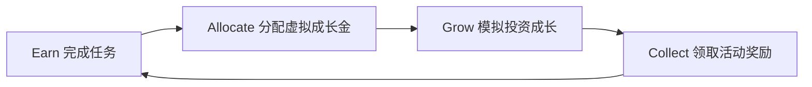
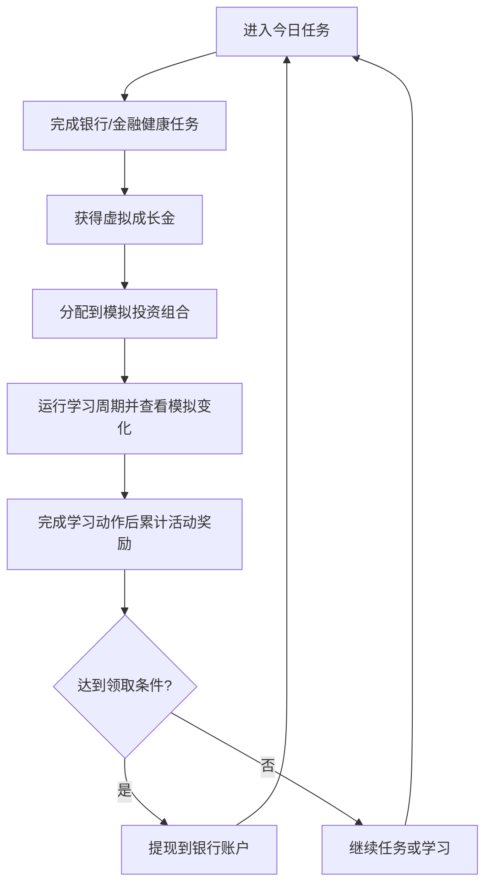
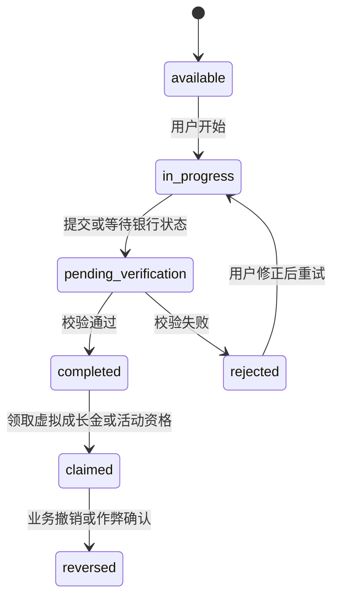

# 银行白标任务奖励与投资学习 App 产品设计方案

Status: Draft v1.1  
Date: 2026-08-18  
Reference prototype: `sprout-prototype.jsx`  
Project type: 独立银行白标 B2B2C Mobile App 产品方案  
Source of truth for: 产品定位、用户体验、核心闭环、页面信息架构、奖励规则、投资学习与合规边界

## 0. 当前交付目标

第一版用户端明确做 mobile app，不做 Web/H5 用户端。

- 用户端技术栈：React Native / Expo + TypeScript。
- 用户端代码目录：`apps/mobile`。
- Web/H5 和小程序后置，除非后续 `BGM` Jira 任务明确改变范围。
- 管理后台如果需要，可作为单独后台 Web Admin 范围处理，不应影响用户端 mobile app 方向。

## 1. 产品一句话

为银行客户提供一个“完成金融健康任务 -> 获得虚拟成长金 -> 在模拟投资中学习资产配置 -> 达成条件后领取真实奖励”的白标 App，帮助银行提升客户活跃、产品教育、资金留存和年轻客群经营。

推荐项目名：

- 中文名：成长金计划
- 英文名：Sprout Bank Rewards
- 银行白标名：可替换为 `{银行名} 成长金`、`{银行名} 投资训练营`、`{银行名} 财富任务`

## 2. 从原型继承的核心设计

`project/sprout-prototype.jsx` 是当前可用原型文件。它的核心不是单个页面样式，而是一个非常清晰的产品闭环：



原型里最值得保留的三个设计原则：

1. 虚拟余额和真实奖励必须分离。
   虚拟成长金是积分或学习余额，不是用户真实资金；奖励罐里的金额才是银行营销预算或活动预算产生的真实可领取奖励。

2. 投资过程优先作为教育和体验。
   用户在 App 内选择定存、债券、黄金、货币基金、平衡基金等模拟标的，理解波动、收益、风险、流动性，而不是被诱导频繁真实交易。

3. 领取奖励必须有规则窗口。
   真实奖励的提现要有月度窗口、上限、KYC、反作弊和银行审核，避免无限套利或误导用户以为投资收益保证可兑付。

4. 原型表达需要银行白标化。
   原型中的 Gen-Z 语气、emoji 图标、`yield`、`coupon`、`returns` 等表达只适合作为概念演示。正式产品应改为银行可信、年轻但克制的表达：使用设计系统图标，避免 emoji 作为结构图标；把 `yield/coupon/return` 改为“模拟变化”“学习周期”“活动奖励率”“奖励规则”等合规词。

## 3. 产品目标

### 3.1 银行侧目标

- 提升年轻客户和新客的月活、留存、绑卡、工资卡、储蓄、基金开户等关键指标。
- 将传统金融教育变成可持续运营的任务体系。
- 用可控营销预算替代一次性补贴，形成长期客户经营。
- 让用户在低风险环境中理解银行产品，再转化到真实理财、基金、黄金、定存等合规产品。
- 为银行提供可配置活动、奖励预算、风险控制和数据分析后台。

### 3.2 用户侧目标

- 每天完成简单任务，获得即时正反馈。
- 清楚区分“虚拟成长金”和“真实可领取奖励”。
- 在模拟环境中学习投资组合、风险等级、收益波动。
- 把真实奖励提取到银行卡或银行账户。
- 在准备好时，自愿进入银行真实投资产品开户或购买流程。

## 4. 目标用户

### 新客用户

刚下载银行 App 或刚开户注册，需要被引导完成身份验证、绑卡、首存、风险测评、学习任务。

核心需求：

- 低门槛开始。
- 明确知道做什么能得奖励。
- 不被金融术语吓退。

### 年轻活跃用户

18-35 岁，有储蓄或投资兴趣，但缺乏系统经验。

核心需求：

- 通过任务和模拟投资获得参与感。
- 看得懂资产配置和收益波动。
- 小额真实奖励带来持续动力。

### 工资卡/信用卡客户

银行已有客户，需要提升绑定、消费、账单、自动储蓄、长期留存。

核心需求：

- 任务和自己的银行行为有关。
- 奖励规则清晰。
- 提现路径简单。

### 银行运营人员

配置活动、任务、预算、投放人群、风控规则，查看数据表现。

核心需求：

- 不改代码即可配置运营活动。
- 可控预算和奖励发放。
- 可审计、可追踪、可暂停。

## 5. 产品边界与合规原则

本产品应被定义为“金融健康任务 + 投资教育 + 银行奖励计划”，不应被定义为“保本收益产品”或“真实投资收益提现”。

必须坚持的语言防火墙：

| 用户看到的概念 | 推荐说法 | 禁止或慎用说法 |
| --- | --- | --- |
| 虚拟余额 | 虚拟成长金、学习余额、模拟资金 | 现金、本金、真实资产 |
| 模拟收益 | 模拟成长、学习结果、情景收益 | 保证收益、稳赚、真实投资收益 |
| 真实奖励 | 银行奖励金、活动奖励、现金券 | 投资分红、理财收益 |
| 投资标的 | 模拟标的、学习组合、风险示例 | 推荐买入、稳赚标的、热门暴涨 |
| 提现 | 领取奖励、提现奖励金 | 提取投资收益 |

合规设计要求：

- 每个页面都要明确展示“虚拟成长金不等于真实资金”。
- 真实奖励必须来自银行活动预算、营销预算或积分权益，不应被描述为模拟投资本身产生的真实收益。
- 如果接入真实基金、理财、黄金、证券或保险产品，必须跳转到银行已有合规销售流程，包含风险测评、产品适当性、销售披露、协议签署和冷静提示。
- 任务奖励规则必须清晰、显著、可保存，避免隐藏条件、临时贬值、任意取消。
- 游戏化设计不能诱导高频交易、夸大收益、制造错失焦虑或用排行榜刺激投资行为。
- 涉及投资建议、AI 推荐、个性化资产配置时，必须经过法务、合规和持牌资质确认。
- 模拟组合涨跌只能影响学习反馈、复盘内容和用户理解，不应直接决定现金奖励金额。
- 真实奖励的产生条件应来自任务完成、学习周期、复盘确认、活动资格和银行预算规则，而不是“投资收益表现”。

参考监管关注点：

- FINRA 对投资平台游戏化功能的关注包括积分、徽章、排行榜、通知等设计是否影响用户投资行为。
- CFPB 对奖励计划的关注包括奖励贬值、模糊条件、阻碍兑换、扣减积分但未提供对应权益等问题。
- SEC 投资者教育材料持续强调线上投资账户安全、个人金融信息保护和防欺诈。

## 6. 产品核心循环

### 6.1 主循环



### 6.2 用户每天看到的体验

1. 打开 App，看到今日任务和成长金余额。
2. 完成一个任务，例如每日签到、学习 3 分钟、完成风险测评、绑定工资卡、设置自动储蓄。
3. 获得虚拟成长金。
4. 去“配置”页把虚拟成长金分到不同模拟产品。
5. 在“成长”页运行一个学习周期，看到组合模拟变化和解释。
6. 完成复盘、风险确认或活动规则要求后，奖励罐增加一笔活动奖励金。
7. 到月度窗口或达到门槛后提现。

## 7. 任务系统设计

任务分为四类：

| 任务类型 | 示例 | 奖励类型 | 风控重点 |
| --- | --- | --- | --- |
| 习惯任务 | 签到、预算记录、储蓄目标更新 | 小额虚拟成长金 | 防刷、频率限制 |
| 学习任务 | 课程、测验、风险题、投资基础 | 虚拟成长金 + 徽章 | 答题质量、重复获取限制 |
| 银行业务任务 | 绑卡、KYC、工资入账、首存、自动储蓄 | 高额虚拟成长金或真实奖励资格 | 真实业务状态校验 |
| 活动任务 | 节日活动、邀请好友、主题挑战 | 限时成长金或奖励券 | 反作弊、预算上限 |

### 7.1 任务卡字段

- 任务标题。
- 任务说明。
- 奖励金额。
- 任务类型。
- 完成条件。
- 截止时间。
- 风险或限制说明。
- 当前状态：待完成、验证中、已完成、未通过、已领取。
- CTA：去完成、提交验证、查看原因、领取奖励。

### 7.2 推荐 MVP 任务

第一版建议只上线高确定性任务：

- 每日签到。
- 完成一节金融知识课。
- 完成风险认知测验。
- 设置一个储蓄目标。
- 完成 KYC 或资料补全 mock。
- 绑定银行账户 mock。
- 首次转入指定金额到储蓄账户 mock。
- 开启自动储蓄 mock。

邀请好友第一版不建议做真实奖励，只保留为后续活动任务。原因是邀请任务的反作弊、预算消耗、归因和多账号风险明显高于普通任务。

### 7.3 任务状态机

MVP 任务状态必须统一，避免前端、后端、后台各自定义状态。



状态含义：

- `available`：用户可开始。
- `in_progress`：任务进行中。
- `pending_verification`：等待系统或人工校验。
- `completed`：已达成条件，但奖励尚未入账或领取。
- `claimed`：奖励已入账。
- `rejected`：未通过，必须展示原因和重试路径。
- `reversed`：已撤销或扣回，必须进入审计日志。

## 8. 虚拟成长金系统

虚拟成长金是用户完成任务后获得的积分型学习余额。

### 8.1 规则

- 不可直接提现。
- 不可转让。
- 可用于模拟投资配置。
- 有总额上限、每日获取上限和活动获取上限。
- 到期规则必须显著展示。
- 可因违规、作弊、退款、撤销业务行为而冻结或扣回，但必须向用户说明原因。

### 8.2 余额展示

首页必须同时显示：

- 虚拟成长金余额。
- 今日可继续赚取额度。
- 奖励罐真实可领取金额。
- 本月奖励领取窗口。

推荐文案：

> 虚拟成长金用于投资学习，不是现金。奖励罐中的金额才可按活动规则提现。

### 8.3 成长金流水规则

虚拟成长金必须采用流水账本而不是直接改余额：

- 每次获得、配置、释放、冻结、扣回都写入 `virtual_balance_ledger`。
- 流水必须包含 `entry_type`、`amount`、`source_type`、`source_id`、`balance_after`、`rule_version`、`created_at`。
- 可用余额、已配置余额、冻结余额应分开计算和展示。
- 后台不得直接改用户余额，只能通过可审计的调整流水完成。

## 9. 模拟投资系统

### 9.1 模拟产品池

MVP 可提供 5 类模拟产品：

| 产品 | 用户标签 | 风险等级 | 波动 | 学习目标 |
| --- | --- | --- | --- | --- |
| 模拟定存 | 稳健 | 低 | 极低 | 理解固定收益和期限 |
| 模拟货币基金 | 灵活 | 低 | 低 | 理解流动性 |
| 模拟债券 | 票息 | 中低 | 低到中 | 理解利率和票息 |
| 模拟黄金 | 避险资产 | 中 | 中高 | 理解商品波动 |
| 模拟平衡基金 | 成长组合 | 中 | 中 | 理解分散配置 |

### 9.2 配置交互

继承原型的 Allocate 页面：

- 展示未配置成长金。
- 每个模拟产品有一张卡。
- 点击展开后显示风险、模拟变化逻辑、波动说明。
- 用滑杆或金额输入配置虚拟成长金。
- 显示组合占比。
- 一键重置。

### 9.3 成长模拟

继承原型的 Grow 页面，但增加解释层：

- 用户点击“运行一个学习周期”或“查看本周模拟变化”。
- 系统展示组合涨跌。
- 每个产品给出一句解释，例如“黄金本期波动较大，这就是商品资产的特点”。
- 奖励罐增加的真实奖励必须显示为“活动奖励”，不能显示为“投资收益”。
- 模拟涨跌不直接决定奖励金额。奖励应由完成学习周期、复盘题、风险确认、活动资格和预算规则决定。

### 9.4 风险教育

每次配置高波动产品前，增加轻量确认：

- 我知道这是模拟学习。
- 我知道高波动产品可能上涨也可能下跌。
- 我知道真实投资需要完成银行风险测评。

## 10. 真实奖励与提现

### 10.1 奖励来源

真实奖励来自银行活动预算，可设计为：

- 现金奖励。
- 现金券。
- 银行积分。
- 手续费减免券。
- 基金申购费优惠券。
- 储蓄加息券。
- 商户权益。

### 10.2 奖励计算

推荐采用“任务贡献 + 学习完成度 + 活动预算”混合模型。避免使用模拟收益率作为奖励计算因子。

示例：

```text
本期奖励 = 可奖励虚拟配置金额 x 活动奖励率 x 学习完成系数 x 风控系数
```

其中：

- 可奖励虚拟配置金额有上限。
- 活动奖励率由银行运营配置。
- 学习完成系数来自课程、测验、风险确认、学习周期、复盘问题等行为。
- 风控系数由反作弊、账户状态、业务撤销、预算余量决定，正常用户为 1，异常用户可为 0 或进入人工审核。
- 单用户每日、每月、每活动都有奖励上限。
- 模拟组合涨跌只能用于教育解释，不进入真实奖励计算公式。

### 10.3 提现规则

MVP 建议：

- 最低提现：由银行配置，例如 5 元、10 元或当地币种等值。
- 提现窗口：每月固定开放，或达到门槛后随时领取。
- 提现账户：仅限本人银行账户。
- KYC：提现前必须完成。
- 风控：异常用户进入人工审核。
- 到账：T+0 / T+1 / T+3 由银行能力决定。

### 10.4 提现页面必须显示

- 奖励罐余额。
- 可提现金额。
- 暂不可提现金额及原因。
- 提现窗口。
- 到账账户。
- 预计到账时间。
- 奖励规则入口。
- 税务或手续费提示，如适用。

### 10.5 奖励与提现状态机

奖励流水状态：

- `pending`：已满足活动条件，等待预算和风控校验。
- `available`：已入奖励罐，可按规则领取。
- `locked`：暂不可领取，需显示原因，例如未到窗口、未完成 KYC、预算复核中。
- `withdrawal_pending`：用户已提交提现申请。
- `paid`：已到账。
- `failed`：发放失败，需给出失败原因和重试路径。
- `reversed`：因违规、业务撤销或对账失败被扣回。

提现申请状态：

- `draft`：用户进入提现页但未提交。
- `submitted`：已提交。
- `under_review`：风控或人工审核中。
- `approved`：已批准，等待打款。
- `rejected`：拒绝，必须展示原因。
- `paid`：已到账。
- `failed`：打款失败，可重试或转人工。
- `cancelled`：用户或后台取消。

## 11. 信息架构

### 11.1 用户端底部导航

| Tab | 中文名 | 英文名 | 作用 |
| --- | --- | --- | --- |
| 首页 | 今日 | Today | 今日任务、余额、奖励罐、下一步 |
| 任务 | 赚成长金 | Earn | 任务列表、学习、银行行为 |
| 配置 | 模拟配置 | Allocate | 分配虚拟成长金 |
| 成长 | 投资学习 | Grow | 组合表现、波动解释、复盘 |
| 奖励 | 奖励罐 | Rewards | 真实奖励、提现、历史 |

底部导航最多 5 个入口，保持原型四段闭环，同时补足首页作为运营承载页。

### 11.2 运营后台

银行使用方需要一个 Web Admin：

| 模块 | 功能 |
| --- | --- |
| 活动管理 | 创建活动、设置时间、人群、预算、奖励上限 |
| 任务管理 | 配置任务、条件、奖励、审核方式 |
| 模拟产品管理 | 配置展示产品、风险说明、模拟参数 |
| 奖励管理 | 奖励发放、提现审核、失败重试、对账 |
| 风控管理 | 设备、账户、邀请、防刷、黑名单规则 |
| 内容管理 | 金融课程、测验、风险教育内容 |
| 数据看板 | 活跃、完成率、成本、转化、留存、提现 |
| 合规审计 | 文案版本、规则版本、用户确认记录、操作日志 |

## 12. 核心页面设计

### 12.1 今日首页

目标：让用户一眼知道今天该做什么。

首屏信息：

- 用户等级或计划进度。
- 虚拟成长金余额。
- 奖励罐真实金额。
- 今日推荐任务。
- 本月提现窗口。

主 CTA：

- “开始今日任务”

次级入口：

- 查看模拟组合。
- 领取奖励。
- 继续学习。

### 12.2 赚成长金

目标：清楚展示任务和奖励。

页面结构：

- 顶部：今日可赚额度和连续完成天数。
- 分类筛选：全部、学习、银行任务、活动、已完成。
- 任务卡列表。
- 任务详情页或底部弹层。

任务状态：

- 可完成。
- 进行中。
- 验证中。
- 已完成未领取。
- 已领取。
- 未通过。

### 12.3 模拟配置

目标：让用户像搭积木一样理解资产配置。

页面结构：

- 未配置成长金。
- 组合风险条。
- 模拟产品卡。
- 配置滑杆。
- 一键智能示例：稳健、均衡、进取。

注意：

- “智能示例”只能作为教育示例，不能叫“推荐组合”，除非银行合规批准。
- 每个产品卡必须有风险等级和模拟说明。

### 12.4 投资学习

目标：通过模拟结果解释金融知识。

页面结构：

- 组合总览。
- 本期模拟变化。
- 产品表现列表。
- 关键学习点。
- 复盘问题。

建议图表：

- 组合占比：优先用堆叠条或列表百分比，移动端少用饼图。
- 模拟变化趋势：用简单折线图。
- 标的波动：用折线图和关键事件说明，不建议在大众用户 MVP 中使用复杂 K 线。

### 12.5 奖励罐

目标：明确、可信地展示真实奖励。

页面结构：

- 奖励罐余额。
- 可提现金额。
- 本月预计奖励。
- 提现按钮。
- 规则说明。
- 奖励历史。
- 提现历史。

关键文案：

> 奖励金由银行活动预算提供，和模拟投资收益不同。实际可领取金额以活动规则和审核结果为准。

### 12.6 真实产品转化页

目标：把学习后的用户温和引导到银行真实产品。

触发条件：

- 用户完成风险课程。
- 用户连续参与模拟投资。
- 用户主动点击“了解真实产品”。

页面原则：

- 不在模拟结果后直接强推“立即买入”。
- 不将模拟收益等同真实收益。
- 必须进入银行合规产品详情页和销售流程。

CTA：

- “了解真实理财产品”
- “完成风险测评”
- “咨询客户经理”
- “先继续模拟学习”

## 13. 视觉与交互设计方向

### 13.1 设计关键词

- Trustworthy：银行可信。
- Playful：任务和成长有趣。
- Calm finance：金融信息冷静表达。
- White-label：支持不同银行品牌替换。
- Transparent：奖励和风险规则清楚。

### 13.2 色彩系统

建议采用“银行信任色 + 活力成长色”的双主轴，而不是完全沿用原型的糖果感。

默认白标色：

| Token | Hex | 用途 |
| --- | --- | --- |
| Primary Navy | `#0F172A` | 顶部、主文本、可信金融基调 |
| Bank Blue | `#1E3A8A` | 主要 CTA、银行品牌扩展 |
| Growth Mint | `#12B886` | 奖励罐、完成、正向成长 |
| Learning Grape | `#6C5CE7` | 学习、配置、模拟 |
| Reward Gold | `#A16207` | 奖励、权益、徽章 |
| Risk Coral | `#DC2626` | 错误、风险、警示 |
| Background | `#F8FAFC` | 页面背景 |
| Card | `#FFFFFF` | 卡片 |
| Border | `#E2E8F0` | 分割线 |
| Muted Text | `#64748B` | 辅助文本 |

银行接入时只替换：

- Primary。
- Secondary。
- CTA。
- Logo。
- 字体。
- 活动插画。

不能替换：

- 风险颜色语义。
- 错误颜色语义。
- 虚拟/真实资金区分样式。
- 披露信息优先级。

### 13.3 字体

推荐：

- 中文：PingFang SC / Microsoft YaHei / Noto Sans SC。
- 英文和数字：IBM Plex Sans 或 Plus Jakarta Sans。
- 金额数字：使用 tabular numbers，避免金额跳动。

### 13.4 组件风格

参考原型的柔和卡片，但降低过度游戏化：

- 卡片圆角：8-16。后台、表格、审核列表使用 8；用户端任务卡和奖励卡可使用 12-16。
- 主按钮圆角：10-14。
- 轻阴影：用于浮层和重要卡片。
- 金融数据区域保持清爽，不使用过重渐变。
- 任务完成、奖励到账可使用轻量动效。
- 所有颜色必须通过语义 token 使用，组件中不直接散落 raw hex。
- 支持 light / dark mode 时，要分别校验文本、图标、边框和禁用态对比度。

移动端实现 source of truth：

- 主题 token：`apps/mobile/src/theme/tokens.ts`。
- 基础组件：`apps/mobile/src/components/`。
- 第一批组件范围：`Screen`、`AppText`、`Card`、`Button`、`Badge`、`MetricCard`、`ProgressBar`、`DisclosureBanner`。
- 后续页面应优先复用这些组件和语义 token；只有当组件无法表达新的业务状态时才扩展组件库。

### 13.5 图标

- 使用 Lucide、Heroicons 或银行设计系统图标。
- 不使用 emoji 作为正式结构图标。`sprout-prototype.jsx` 中的 emoji 只能作为演示占位。
- 可在营销插画或空状态中使用品牌插画。

## 14. 关键交互规则

- 所有可点击区域不小于 44 x 44 pt。
- 每个页面只有一个最主要 CTA。
- 任务完成后必须有即时反馈。
- 涉及提现、真实账户、真实产品，必须二次确认。
- 投资模拟结果为负时使用冷静解释，不用强烈恐慌视觉。
- 奖励到账失败必须给出原因和重试路径。
- 用户可以跳过新手教程，但不能跳过必要披露和确认。
- 动效时长控制在 150-300ms。
- 支持减少动态效果模式。
- 所有图标按钮必须有可访问名称。
- 表单必须使用可见 label，不使用仅 placeholder 的字段。
- 底部导航、固定 CTA 和弹层必须处理安全区，避免内容被系统手势条遮挡。

## 15. 业务规则与风控

### 15.1 奖励预算

银行后台需要配置：

- 活动总预算。
- 每日预算。
- 单用户每日奖励上限。
- 单用户月度奖励上限。
- 单任务奖励上限。
- 邀请奖励上限。
- 异常暂停阈值。

### 15.2 反作弊

需要监控：

- 多账号同设备。
- 多账号同银行卡。
- 高频注册。
- 高频任务提交。
- 邀请链异常。
- 设备指纹异常。
- IP 和地理位置异常。
- 业务行为撤销后仍领取奖励。

### 15.3 审计

必须保存：

- 用户完成任务记录。
- 奖励计算记录。
- 提现申请记录。
- 规则版本。
- 文案版本。
- 用户确认过的披露版本。
- 后台操作日志。

## 16. 数据模型草案

### 用户端核心表

| 表 | 说明 |
| --- | --- |
| users | 银行用户映射、KYC 状态、风险等级、租户归属 |
| bank_accounts | 用户绑定银行账户 mock 或真实映射 |
| reward_programs | 银行活动计划、时间、地区、预算和规则版本 |
| tasks | 任务配置、校验方式、奖励规则、披露要求 |
| user_tasks | 用户任务进度和统一状态机 |
| virtual_balances | 可用、已配置、冻结虚拟成长金余额 |
| virtual_balance_ledger | 虚拟成长金流水，所有余额变化从这里追溯 |
| simulation_products | 模拟产品配置、风险说明、模拟参数、展示顺序 |
| user_allocations | 用户模拟配置、占比、最后调整时间 |
| simulation_runs | 模拟周期结果、学习解释、复盘问题 |
| reward_jars | 真实奖励罐汇总余额和可提现余额 |
| reward_ledger | 真实奖励流水、活动来源、预算批次、状态 |
| withdrawal_requests | 提现申请、审核状态、失败原因和到账信息 |
| disclosure_versions | 披露、规则、文案版本 |
| disclosure_acceptances | 用户确认过的披露和规则版本 |

### 后台核心表

| 表 | 说明 |
| --- | --- |
| bank_tenants | 银行租户 |
| admin_users | 银行后台用户 |
| admin_roles | 后台角色和权限 |
| program_budgets | 活动预算 |
| risk_rules | 风控规则 |
| content_lessons | 课程内容 |
| quizzes | 测验 |
| audit_logs | 审计日志 |

### 16.1 关键枚举

第一版建议先固定这些枚举，后续再配置化：

| 枚举 | 建议值 |
| --- | --- |
| `task_status` | `available`, `in_progress`, `pending_verification`, `completed`, `claimed`, `rejected`, `reversed` |
| `virtual_ledger_type` | `earn`, `allocate`, `release`, `freeze`, `unfreeze`, `reversal`, `adjustment` |
| `reward_status` | `pending`, `available`, `locked`, `withdrawal_pending`, `paid`, `failed`, `reversed` |
| `withdrawal_status` | `draft`, `submitted`, `under_review`, `approved`, `rejected`, `paid`, `failed`, `cancelled` |
| `disclosure_type` | `virtual_balance`, `simulation`, `reward_rule`, `withdrawal`, `real_product_redirect` |

## 17. API 模块草案

用户端：

- `GET /api/app/home`
- `GET /api/tasks?status=&type=`
- `POST /api/tasks/:id/start`
- `POST /api/tasks/:id/submit`
- `POST /api/tasks/:id/claim`
- `GET /api/virtual-balance`
- `GET /api/virtual-balance/ledger`
- `GET /api/simulation/products`
- `PUT /api/simulation/allocations`
- `POST /api/simulation/run`
- `POST /api/simulation/runs/:id/reflection`
- `GET /api/rewards/jar`
- `POST /api/rewards/withdraw`
- `GET /api/rewards/history`
- `GET /api/withdrawals`
- `POST /api/disclosures/:id/accept`

银行后台：

- `POST /api/admin/programs`
- `PUT /api/admin/programs/:id`
- `POST /api/admin/tasks`
- `PUT /api/admin/tasks/:id`
- `GET /api/admin/budgets`
- `GET /api/admin/rewards`
- `POST /api/admin/withdrawals/:id/approve`
- `POST /api/admin/withdrawals/:id/reject`
- `POST /api/admin/withdrawals/:id/retry`
- `GET /api/admin/audit-logs`
- `GET /api/admin/dashboard`

## 18. MVP 范围

### 18.1 Demo MVP

目标：最快做出可演示、可试用的端到端闭环，适合内部评审和银行前期沟通。

技术默认采用本仓库约定：

- 用户端：React Native / Expo + TypeScript。
- 用户端目录：`apps/mobile`。
- 后端：Node.js + Express。
- 数据：开发期可先用 SQLite / PostgreSQL 二选一；若准备进入银行试点，直接使用 PostgreSQL。
- 形态：优先做 mobile app。Web H5 和小程序先不做，后续如银行渠道需要再复用核心业务与设计系统扩展。

Demo MVP 包含：

- Mock 登录和单一银行租户。
- 首页。
- 任务列表、任务详情、任务完成。
- 虚拟成长金余额和流水。
- 5 个模拟产品。
- 模拟配置。
- 运行一个学习周期。
- 复盘问题和风险确认。
- 奖励罐和奖励流水。
- 提现申请。
- 后台活动配置、任务配置、提现审核的最小能力。
- 必要披露和规则确认。

Demo MVP 不接入：

- 真实 KYC。
- 真实银行账户查询。
- 真实转账或打款。
- 真实基金、理财、黄金、证券交易。
- 邀请返利真实奖励。
- AI 投资建议。

### 18.2 Bank Pilot MVP

目标：用于一家银行试点，需要补齐真实业务集成和审计要求。

- 登录和银行账户绑定。
- 首页。
- 任务列表和任务详情。
- 虚拟成长金余额。
- 5 个模拟产品。
- 模拟配置。
- 运行一个学习周期。
- 奖励罐。
- 提现申请。
- 奖励和任务历史。
- 必要披露和规则说明。
- 真实 KYC、账户状态、提现打款或对账接口按银行能力接入。

### 18.3 银行后台 MVP

- 活动创建。
- 任务配置。
- 奖励预算配置。
- 提现审核。
- 基础数据看板。
- 审计日志。

### 18.4 MVP 不做

- 真实证券交易。
- AI 投资建议。
- 排行榜。
- 高频交易挑战。
- 社交晒收益。
- 复杂 K 线交易界面。
- 多级邀请返利。

## 19. 后续版本路线

### V1.0 验证版

目标：验证任务奖励和模拟投资学习闭环。

- 上线一个银行租户。
- 支持基础任务和提现。
- 支持后台配置。
- 跑通奖励预算和对账。

### V1.5 运营增强

目标：提升留存和活动效率。

- 用户分群。
- 活动模板。
- 自动化任务推荐。
- 学习路径。
- 更完整的数据看板。

### V2.0 金融产品转化

目标：把教育用户转化到真实银行产品。

- 风险测评接入。
- 真实产品详情跳转。
- 客户经理咨询。
- 个性化但合规的产品教育。
- 生命周期运营。

### V3.0 多租户平台化

目标：成为可复制给多家银行的白标平台。

- 多银行租户。
- 品牌主题配置。
- 权限体系。
- 多币种。
- 多地区合规模板。
- 运营策略实验。

## 20. 成功指标

### 用户增长

- 注册转化率。
- KYC 完成率。
- 银行账户绑定率。
- 首周留存。
- 月活用户。

### 任务参与

- 每日任务完成率。
- 学习任务完成率。
- 银行业务任务完成率。
- 人均虚拟成长金获取。
- 连续参与天数。

### 投资教育

- 模拟配置完成率。
- 模拟周期运行次数。
- 风险确认完成率。
- 学习测验通过率。
- 真实产品了解点击率。

### 奖励与成本

- 奖励领取率。
- 提现成功率。
- 单活跃用户奖励成本。
- 单转化客户奖励成本。
- 异常奖励拦截金额。

### 银行业务转化

- 首存转化。
- 自动储蓄开通。
- 工资卡绑定。
- 理财/基金开户。
- 客户经理咨询预约。

## 21. 研发建议

如果独立立项，建议技术架构：

- 用户端：React Native / Expo + TypeScript，优先 mobile app。
- 管理后台：React + TypeScript + Vite / Next.js。
- 后端：Node.js + Express，核心业务服务按模块拆分。
- 数据库：PostgreSQL。
- 鉴权：银行 SSO / OAuth / OIDC。
- 风控：规则引擎 + 审计日志。
- 事件：任务、奖励、提现全部事件化，便于对账和审计。

如果先快速验证：

- 可以先做 Expo mobile app 原型。
- 后台先做最小配置能力。
- 模拟产品参数写入配置表。
- 提现可以先生成人工审核单，不直接自动打款。

## 22. 第一批可拆研发任务

1. 搭建独立项目脚手架。
2. 建立银行租户和主题配置。
3. 实现用户登录和银行账户绑定 mock。
4. 实现任务配置和任务列表。
5. 实现任务完成与虚拟成长金流水。
6. 实现模拟产品池。
7. 实现虚拟成长金配置。
8. 实现学习周期运行和模拟变化解释。
9. 实现复盘问题、风险确认和学习完成系数。
10. 实现奖励罐和奖励流水。
11. 实现提现申请。
12. 实现银行后台活动配置。
13. 实现银行后台奖励审核。
14. 增加披露确认和审计日志。
15. 完成移动端 UI 主题和组件库。
16. 根据 `sprout-prototype.jsx` 重建正式版页面，不直接沿用 emoji、收益诱导文案和固定手机壳样式。

## 23. 关键待确认问题

- 目标市场和监管地区是哪一个国家或地区？
- 真实奖励是现金、积分、优惠券，还是多种权益？
- 提现是否必须到本行账户？
- 是否接入银行真实 KYC、账户、支付和转账系统？
- 模拟投资标的是只做教育，还是未来接入真实基金/理财产品？
- 银行是否允许“投资”“收益”“提现”等词出现在营销主路径？
- 单用户月度奖励预算上限是多少？
- 是否需要支持未成年人或家庭账户？
- 是否需要多银行租户，还是先为一家银行定制？
- 第一版交付形态已确认优先 mobile app；Web H5 和小程序后置。
- Demo MVP 是否可以全部使用 mock KYC、mock 银行账户和人工提现审核？
- 奖励计算是否确认不绑定模拟组合涨跌，只绑定学习动作和活动规则？

## 24. 结论

这个产品最好的定位不是“投资赚钱 App”，而是“银行金融健康任务和投资学习奖励平台”。用户通过任务获得虚拟成长金，通过模拟投资理解风险和配置，再按清晰规则领取银行提供的真实奖励。这样既保留了 `sprout-prototype.jsx` 的趣味闭环，也更适合银行长期运营、合规审查和真实业务转化。
